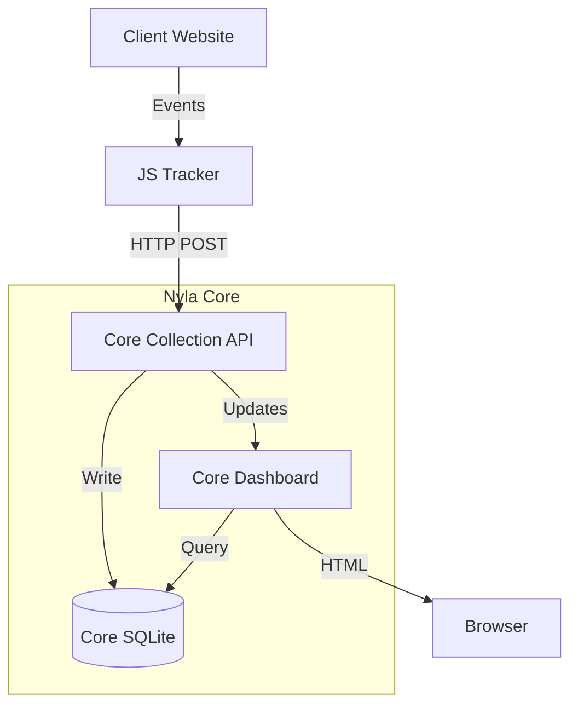
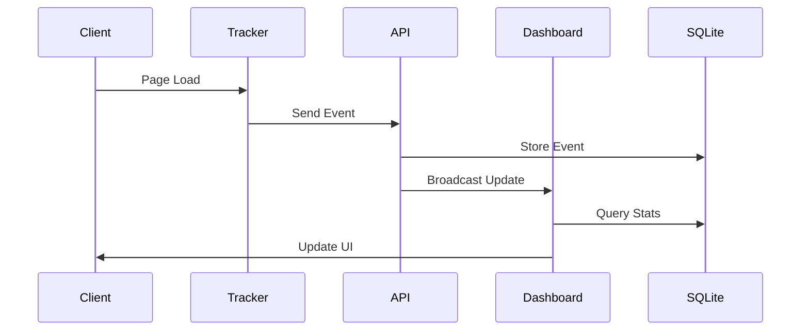
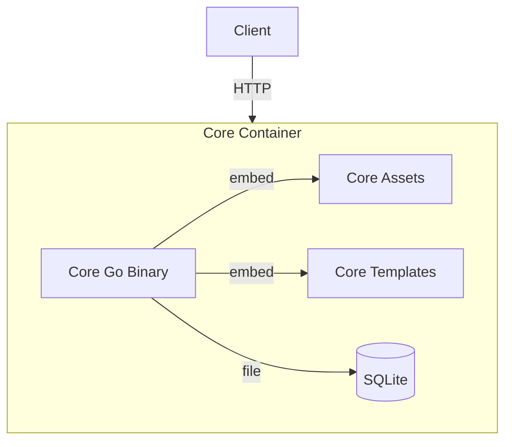

# Nyla Analytics Core - Architecture Overview

## System Overview

Nyla Analytics Core is the open-source foundation of a privacy-focused web analytics platform. The Core provides essential analytics capabilities for self-hosted deployments and serves as the foundation for the commercial SaaS offering.

## Core Architecture

Nyla Analytics Core provides essential analytics capabilities:

### Core Components
1. **Event Collection Engine** - High-performance event ingestion and processing
2. **JavaScript Tracker** - Lightweight, privacy-focused client library (<5KB)
3. **Analytics Dashboard** - Clean, single-site interface for essential metrics
4. **Storage Layer** - SQLite-based data persistence with privacy controls

## System Architecture Diagrams

### Core Architecture

### Data Flow

### Deployment Architecture

#### Core Self-Hosted Deployment

## Key Technical Decisions

### Core Backend Stack

- **Language**: Go 1.24+
  - Rationale: Single binary deployment, excellent performance, strong concurrency
  - Minimal external dependencies for Core functionality
  - Clear package boundaries for open-core architecture
  - Built-in testing and benchmarking tools
  - Cross-platform compilation support

- **Database**: SQLite
  - SQLite for zero-config self-hosting
  - Built-in WAL mode for concurrent access
  - Simple backup and migration processes

- **API Design**: RESTful with Extension Points
  - Clean Core API boundaries
  - Feature gating for commercial functionality
  - Stable public interfaces for extensions
  - Basic real-time updates in Core
  - Enhanced SSE capabilities in Commercial

### Core Frontend Stack

- **Core Interface**: Server-rendered HTML
  - Minimal JavaScript requirements
  - Essential analytics display only
  - Single-site dashboard
  - Basic real-time updates
  - Mobile-responsive design
  - Accessibility focused

- **Core Build System**:
  - Single Go binary with embedded assets
  - No external build dependencies
  - Standard Go toolchain only
  - Cross-platform compilation
  - Minimal resource usage

- **Core Templates**: Go html/template
  - Built into Go standard library
  - Security-focused by default
  - Simple dashboard layouts
  - Essential metric displays
  - Basic responsive design

### Core Infrastructure

- **Core Deployment**: Single Binary + SQLite
  - Self-contained Go binary
  - Embedded HTML templates and assets
  - SQLite as only external dependency
  - File-based configuration
  - Simple container deployment

- **Extension Architecture**: Plugin Interfaces
  - Clean API boundaries for commercial features
  - Stable extension points
  - Feature flag system
  - Backward compatibility guarantees

### Core Development Workflow

- **Open Source Development**: 
  - Public GitHub repository
  - Community contributions welcome
  - Transparent roadmap and issue tracking
  - Core-focused feature development

- **Core CI/CD**: GitHub Actions
  - Core functionality testing
  - Cross-platform binary builds
  - Container image publishing
  - Automated security scanning

- **Core Code Quality**:
  - Go tests for core functionality
  - API compatibility testing
  - Security-focused code review
  - Performance benchmarking

## Core System Components

### Core Collection Engine

- High-performance event ingestion
- Privacy-first data processing
- Basic rate limiting and validation
- Single-site data isolation
- IP anonymization by default
- Essential event types (pageviews, custom events)
- Extension points for commercial features

### Core JavaScript Tracker

- Ultra-lightweight (<5KB gzipped)
- Zero external dependencies
- Essential tracking functionality
- Privacy controls built-in
- DoNotTrack compliance
- Single-site configuration
- Self-hosted deployment support

### Core Analytics Dashboard

- Minimal, essential metrics display
- Single-site analytics view
- Basic real-time updates
- Server-rendered HTML
- Mobile-responsive design
- Accessibility compliance
- Simple, clean interface

### Core Storage Layer

- SQLite-based data persistence
- Single-site data model
- Basic retention policies
- Simple backup procedures
- Essential indexes for performance
- Privacy-compliant data handling

## Core Features

### Essential Analytics
- Real-time visitor count
- Page view tracking
- Basic session analytics
- Top pages/referrers
- Time-based metrics (hourly/daily)
- Simple data export (JSON/CSV)

### Privacy & Security
- Privacy-first by design
- IP anonymization by default
- Configurable data retention
- No cross-site tracking
- No cookies required
- GDPR/CCPA compliance
- Content Security Policy compatible
- Basic API key authentication

## Extension Capabilities

The Nyla Core architecture provides flexible extension points:

### Plugin Architecture
- Clean API boundaries for extensibility
- Stable interfaces for custom integrations
- Feature flag system for optional functionality
- Backward compatibility guarantees

### Data Processing Extensions
- Custom event processors
- Additional aggregation methods
- Enhanced filtering capabilities
- Custom export formats

### Interface Extensions
- Custom dashboard components
- Additional visualization types
- Enhanced reporting tools
- Third-party integrations 