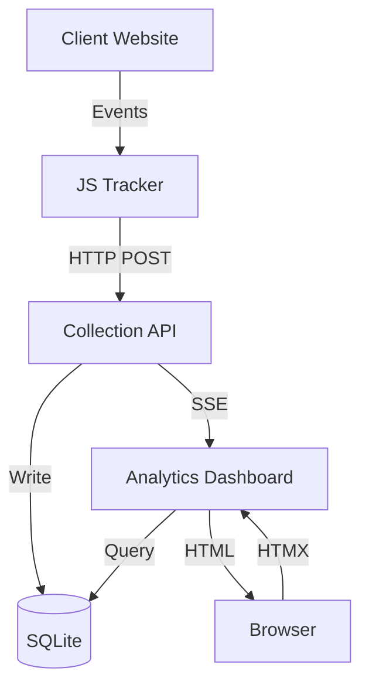
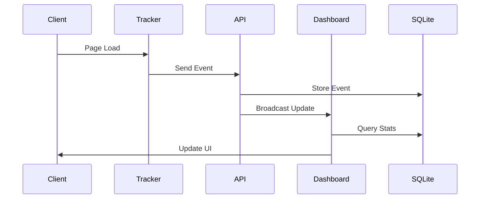
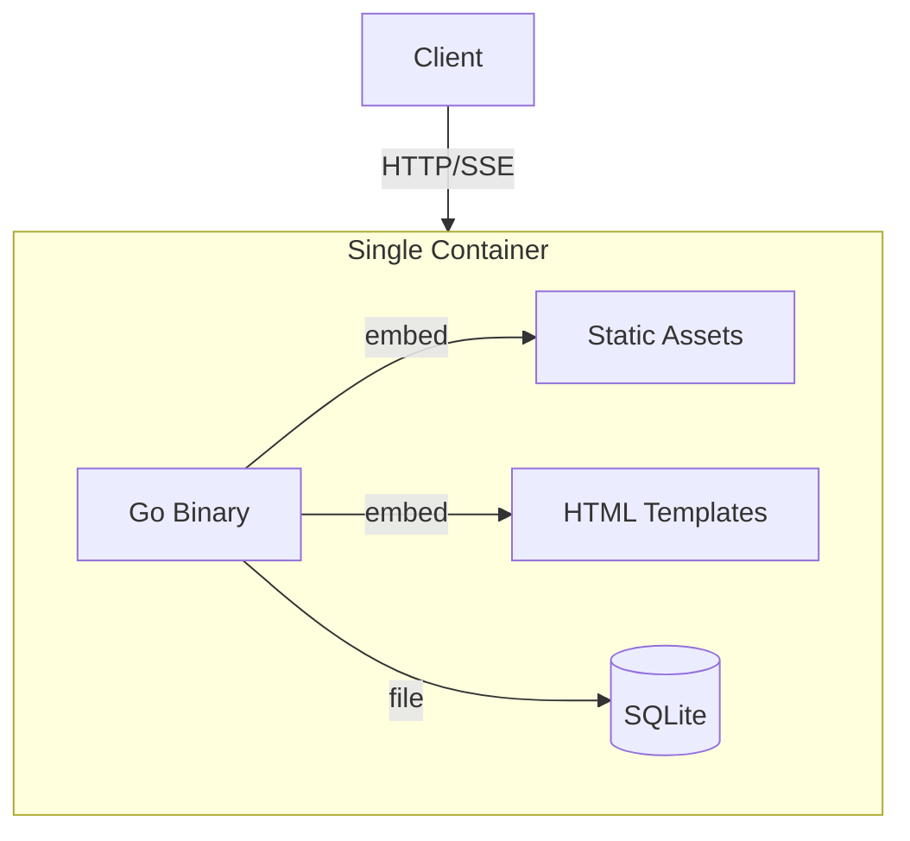

# Nyla Analytics - Architecture Overview

## System Overview

Nyla is a privacy-focused, self-hosted web analytics platform designed for simplicity and performance. The system consists of four main components:

1. Collection API - Core event ingestion service
2. JavaScript Tracker - Lightweight client-side collector
3. Analytics Dashboard - Server-rendered hypermedia interface
4. Storage Layer - Event data persistence

## System Architecture Diagrams

### Component Interaction

### Data Flow

### Deployment Architecture

## Key Technical Decisions

### Backend Stack

- **Language/Framework**: Go
  - Rationale: Excellent performance, small binary size, great concurrency support
  - Simple deployment with single static binary
  - Strong standard library reducing external dependencies
  - Built-in templating for HTML generation
  - Built-in testing framework

- **Database**: SQLite
  - Rationale: Zero-config, single file database perfect for self-hosting
  - Excellent performance for read-heavy analytics workloads
  - Built-in WAL mode for concurrent access
  - Simple backup process
  - Can be upgraded to PostgreSQL in future if needed

- **API Design**: Hypermedia-Driven with Server-Sent Events (SSE)
  - HTML-over-the-wire using HTMX
  - SSE for real-time dashboard updates
  - Progressive enhancement
  - Minimal JavaScript footprint
  - Excellent browser support

### Frontend Stack

- **Framework**: HTMX + Hyperscript
  - Rationale: Hypermedia-driven architecture
  - Tiny footprint (<14KB gzipped for HTMX)
  - No build step required
  - Server-side rendering
  - Progressive enhancement
  - Real-time updates via SSE

- **State Management**:
  - Server-side state in SQLite
  - Client-side state via HTMX triggers
  - Local storage for preferences
  - SSE for real-time updates
  - No complex client state management needed

- **Build Tooling**:
  - esbuild for JS minification
    - Fast builds
    - Modern output
    - Tree shaking
  - PostCSS for Tailwind
    - CSS purging
    - Minimal production CSS
  - go:embed for static assets
    - Single binary deployment
    - No external asset server needed

- **Component Library**:
  - TailwindUI components
    - Consistent design language
    - Accessible by default
    - Mobile-first responsive
  - Custom HTMX components
    - Reusable interaction patterns
    - Progressive enhancement
    - Minimal JavaScript

- **Templates**: Go html/template
  - Built into Go standard library
  - Secure by default
  - Composable layouts and partials
  - Simple to maintain and test

- **Styling**: TailwindCSS
  - Utility-first approach for rapid development
  - Small production bundles
  - Good component library ecosystem
  - Easy theming support

### Infrastructure

- **Deployment**: Single Binary + SQLite
  - Everything packaged in one Go binary
  - HTML templates embedded in binary
  - SQLite database file as only external dependency
  - Simple backup requirements

- **Configuration**: Environment Variables + Config File
  - Basic settings via environment variables
  - Advanced options in optional YAML config
  - Sensible defaults for everything

### Development Workflow

- **Version Control**: Git + GitHub
  - Trunk-based development
  - Pull request workflow
  - Automated testing on PRs

- **CI/CD**: GitHub Actions
  - Automated testing
  - Binary builds for all platforms
  - Container image builds
  - Automated releases

- **Code Quality**:
  - Go tests with testify
  - HTML validation
  - ESLint + Prettier for HTMX/Hyperscript
  - golangci-lint

## System Components

### Collection API

- RESTful endpoints for event ingestion
- Basic request validation and sanitization
- IP anonymization and privacy controls
- Simple rate limiting
- Efficient batch processing
- Real-time event broadcasting

### JavaScript Tracker

- Tiny (<5KB gzipped) browser script
- No external dependencies
- Automatic pageview tracking
- Custom event support
- Respect DoNotTrack
- Privacy-focused by default
- Configurable data collection

### Analytics Dashboard

- Server-rendered HTML interface
- Real-time updates via SSE
- Minimal client-side JavaScript
- Progressive enhancement
- Mobile-first responsive design
- Dark/light themes
- Accessible by default

### Storage Layer

- Efficient SQLite schema
- Automatic data retention
- Simple backup process
- Basic data export
- Privacy compliance helpers

## Hypermedia Features

- HTML-over-the-wire updates
- Out-of-band updates via SSE
- Optimistic UI updates
- Form validation
- Infinite scroll
- Modal dialogs
- Toast notifications
- Loading indicators

## Security & Privacy

- Privacy-first design
- IP anonymization by default
- Configurable data retention
- No cross-site tracking
- No cookies required
- GDPR/CCPA friendly defaults
- CSP compatible

## Future Considerations

- PostgreSQL upgrade path
- Multi-site support
- Custom dashboards
- Advanced event filtering
- API authentication
- Team management
- Export/import tools 